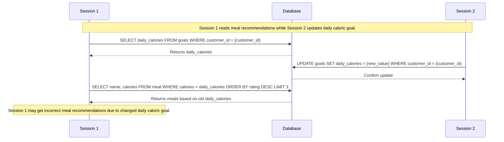
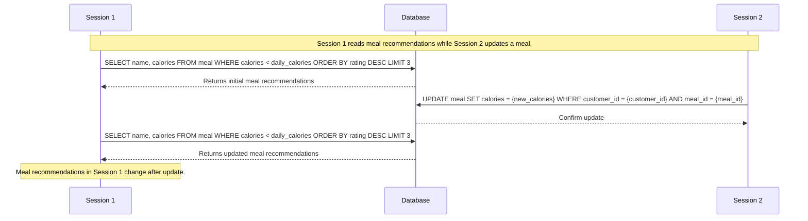
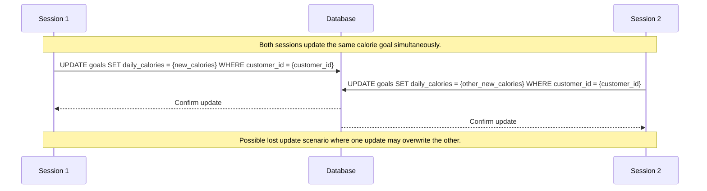

# Concurrency
We will outline three cases where our service would encounter phenomenon if it had no concurrency control protection in place.

---
### 1. Non-Repeatable Read 
**Phenomenon**: A transaction reads the same row twice and gets a different value each time.
File: `meal.py` 
**Scenario**: A user requests a meal recommendation with `/meal/{customer_id}/recommend` at the same time their daily caloric goal is lowered with `/{customer_id}`, putting the recommended meal over the daily calorie goal.

**Solution**: Implement a locking mechanism that does not allow READs and UPDATEs to happen at the same time.

---
### 2. Non-Repeatable Read *part 2, electric boogaloo* 
**Phenomenon**: A transaction reads the same row twice and gets a different value each time.
File: `meal.py` *again* 
**Scenario**: A user requests a meal recommendation with `/meal/{customer_id}/recommend` at the same time a meal is updated with `/{customer_id}/{meal_id}` such that their daily calories are changed, putting the recommended meal over the daily calorie goal.

**Solution**: Again, implement a locking mechanism that does not allow READs and UPDATEs to happen at the same time.

---
### 3. Lost update
**Phenomenon**: Two identical queries are executed, but the rows retrieved by the two are different.
File: `goal.py` 
**Scenario**: A user updates their calorie goal with `/{customer_id}` in 2 sessions at the same time, losing one of the updates.

**Solution**: Raise transaction isolation level to REPEATABLE READ (default).

